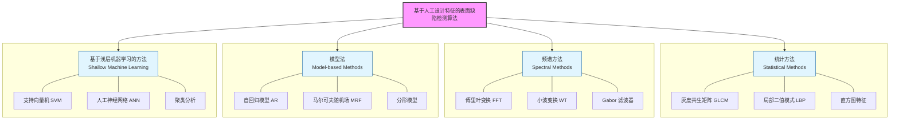

```mermaid
graph TD
    A[基于人工设计特征的表面缺陷检测算法] --> B[统计方法<br/>Statistical Methods]
    A --> C[频谱方法<br/>Spectral Methods]
    A --> D[模型法<br/>Model-based Methods]
    A --> E[基于浅层机器学习的方法<br/>Shallow Machine Learning]

    subgraph " "
    B --- B1[灰度共生矩阵 GLCM]
    B --- B2[局部二值模式 LBP]
    B --- B3[直方图特征]
    end

    subgraph " "
    C --- C1[傅里叶变换 FFT]
    C --- C2[小波变换 WT]
    C --- C3[Gabor 滤波器]
    end

    subgraph " "
    D --- D1[自回归模型 AR]
    D --- D2[马尔可夫随机场 MRF]
    D --- D3[分形模型]
    end

    subgraph " "
    E --- E1[支持向量机 SVM]
    E --- E2[人工神经网络 ANN]
    E --- E3[聚类分析]
    end

    style A fill:#f9f,stroke:#333,stroke-width:2px
    style B fill:#e1f5fe,stroke:#01579b
    style C fill:#e1f5fe,stroke:#01579b
    style D fill:#e1f5fe,stroke:#01579b
    style E fill:#e1f5fe,stroke:#01579b
```