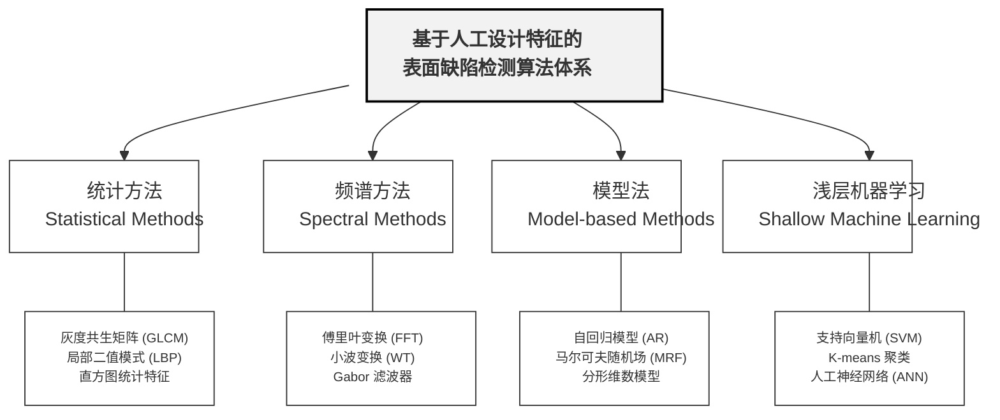

```mermaid
graph TB
    %% 核心标题
    Main[基于人工设计特征的<br/>表面缺陷检测算法体系] 
    
    %% 第一层级：四大分支 (设置固定宽度)
    Statistical[统计方法<br/>Statistical Methods]
    Spectral[频谱方法<br/>Spectral Methods]
    Model[模型法<br/>Model-based Methods]
    Machine[浅层机器学习<br/>Shallow Machine Learning]

    %% 第二层级：典型算法 (通过样式保持与上方一致)
    Sub_Stat["灰度共生矩阵 (GLCM)<br/>局部二值模式 (LBP)<br/>直方图统计特征"]
    Sub_Spec["傅里叶变换 (FFT)<br/>小波变换 (WT)<br/>Gabor 滤波器"]
    Sub_Mod["自回归模型 (AR)<br/>马尔可夫随机场 (MRF)<br/>分形维数模型"]
    Sub_Mach["支持向量机 (SVM)<br/>K-means 聚类<br/>人工神经网络 (ANN)"]

    %% 建立连接
    Main --> Statistical
    Main --> Spectral
    Main --> Model
    Main --> Machine

    Statistical --- Sub_Stat
    Spectral --- Sub_Spec
    Model --- Sub_Mod
    Machine --- Sub_Mach

    %% --- 样式调整：实现宽度一致 ---
    %% 设置所有方块的基础样式
    classDef common fill:#ffffff,stroke:#333,stroke-width:1px,width:160px;
    
    class Statistical,Spectral,Model,Machine common;
    class Sub_Stat,Sub_Spec,Sub_Mod,Sub_Mach common;

    %% 标题特殊样式
    style Main fill:#f2f2f2,stroke:#000,stroke-width:2px,font-weight:bold,width:250px
    
    %% 细化内容样式
    style Sub_Stat font-size:11px,text-align:center
    style Sub_Spec font-size:11px,text-align:center
    style Sub_Mod font-size:11px,text-align:center
    style Sub_Mach font-size:11px,text-align:center
```