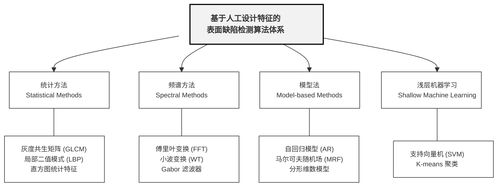

```mermaid
graph TB
    %% 核心标题
    Main[基于人工设计特征的<br/>表面缺陷检测算法体系] 
    
    %% 第一层级：四大分支 (设置固定宽度 180px)
    Statistical[统计方法<br/>Statistical Methods]
    Spectral[频谱方法<br/>Spectral Methods]
    Model[模型法<br/>Model-based Methods]
    Machine[浅层机器学习<br/>Shallow Machine Learning]

    %% 第二层级：典型算法 (手动折行确保不溢出)
    Sub_Stat["灰度共生矩阵 (GLCM)<br/>局部二值模式 (LBP)<br/>直方图统计特征"]
    Sub_Spec["傅里叶变换 (FFT)<br/>小波变换 (WT)<br/>Gabor 滤波器"]
    Sub_Mod["自回归模型 (AR)<br/>马尔可夫随机场 (MRF)<br/>分形维数模型"]
    Sub_Mach["支持向量机 (SVM)<br/>K-means 聚类<br/>"]

    %% 建立连接
    Main --> Statistical
    Main --> Spectral
    Main --> Model
    Main --> Machine

    Statistical --- Sub_Stat
    Spectral --- Sub_Spec
    Model --- Sub_Mod
    Machine --- Sub_Mach

    %% --- 论文级样式控制 ---
    %% 统一所有节点的宽度为 180px，确保上下对齐且文字不溢出
    classDef boxStyle fill:#ffffff,stroke:#333,stroke-width:1px,width:180px,font-size:12px;
    
    class Statistical,Spectral,Model,Machine boxStyle;
    class Sub_Stat,Sub_Spec,Sub_Mod,Sub_Mach boxStyle;

    %% 标题样式：略宽一些以容纳长标题
    style Main fill:#f2f2f2,stroke:#000,stroke-width:2px,font-weight:bold,width:240px,font-size:14px
    
    %% 强制微调子项对齐
    style Sub_Stat text-align:center
    style Sub_Spec text-align:center
    style Sub_Mod text-align:center
    style Sub_Mach text-align:center
```