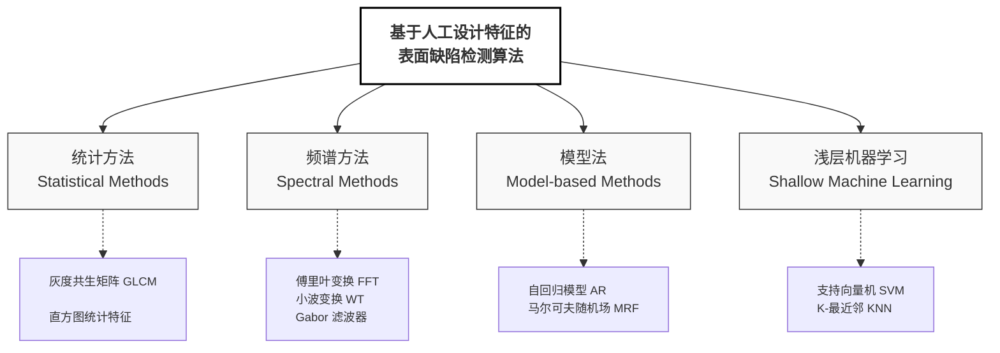

```mermaid
graph TB
    %% 核心标题
    Main[
    基于人工设计特征的
    表面缺陷检测算法] 
    
    %% 第一层级：四大分支
    Statistical[统计方法<br/>Statistical Methods]
    Spectral[频谱方法<br/>Spectral Methods]
    Model[模型法<br/>Model-based Methods]
    Machine[浅层机器学习<br/>Shallow Machine Learning]

    %% 第二层级：典型算法
    Sub_Stat[灰度共生矩阵 GLCM<br/><br/>直方图统计特征]
    Sub_Spec[傅里叶变换 FFT<br/>小波变换 WT<br/>Gabor 滤波器]
    Sub_Mod[自回归模型 AR<br/>马尔可夫随机场 MRF<br/>]
    Sub_Mach[支持向量机 SVM<br/>K-最近邻 KNN]

    %% 建立连接
    Main --> Statistical
    Main --> Spectral
    Main --> Model
    Main --> Machine

    Statistical -.-> Sub_Stat
    Spectral -.-> Sub_Spec
    Model -.-> Sub_Mod
    Machine -.-> Sub_Mach

    %% 样式美化：论文通常使用白底黑字或淡色调
    style Main fill:#ffffff,stroke:#000,stroke-width:2px,font-weight:bold
    style Statistical fill:#f9f9f9,stroke:#333,stroke-width:1px
    style Spectral fill:#f9f9f9,stroke:#333,stroke-width:1px
    style Model fill:#f9f9f9,stroke:#333,stroke-width:1px
    style Machine fill:#f9f9f9,stroke:#333,stroke-width:1px
    
    %% 细化子项样式
    style Sub_Stat font-size:12px,text-align:left
    style Sub_Spec font-size:12px,text-align:left
    style Sub_Mod font-size:12px,text-align:left
    style Sub_Mach font-size:12px,text-align:left
```