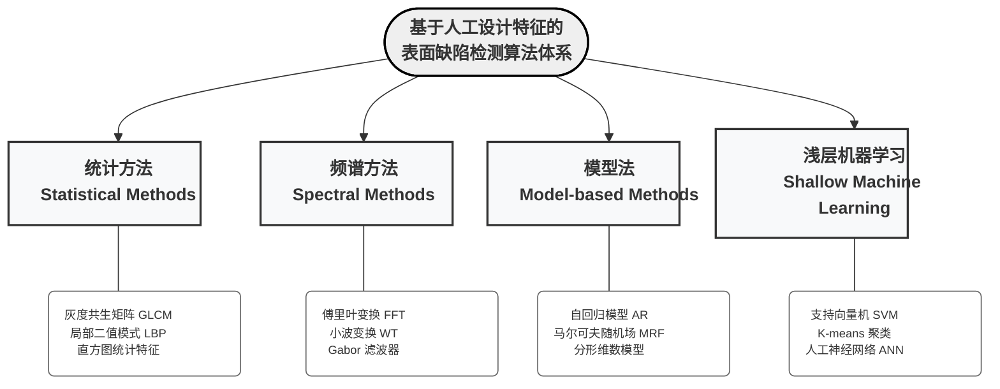

```mermaid
graph TB
    %% 核心标题
    Main([基于人工设计特征的<br/>表面缺陷检测算法体系]) 
    
    %% 第一层级：四大分支 (使用直角矩形)
    Statistical[统计方法<br/>Statistical Methods]
    Spectral[频谱方法<br/>Spectral Methods]
    Model[模型法<br/>Model-based Methods]
    Machine[浅层机器学习<br/>Shallow Machine Learning]

    %% 第二层级：典型算法 (使用圆角矩形)
    Sub_Stat(灰度共生矩阵 GLCM<br/>局部二值模式 LBP<br/>直方图统计特征)
    Sub_Spec(傅里叶变换 FFT<br/>小波变换 WT<br/>Gabor 滤波器)
    Sub_Mod(自回归模型 AR<br/>马尔可夫随机场 MRF<br/>分形维数模型)
    Sub_Mach(支持向量机 SVM<br/>K-means 聚类<br/>人工神经网络 ANN)

    %% 建立连接
    Main --> Statistical
    Main --> Spectral
    Main --> Model
    Main --> Machine

    Statistical --- Sub_Stat
    Spectral --- Sub_Spec
    Model --- Sub_Mod
    Machine --- Sub_Mach

    %% --- 样式设计 ---
    %% 标题：加粗，浅灰色背景
    style Main fill:#efefef,stroke:#000,stroke-width:2px,font-weight:bold,width:250px
    
    %% 第二层级：定义为 Level2 类，使用蓝色系（或深灰），加粗边框
    classDef Level2 fill:#f8f9fa,stroke:#333,stroke-width:2px,width:180px,font-weight:bold;
    class Statistical,Spectral,Model,Machine Level2;
    
    %% 第三层级：定义为 Level3 类，使用纯白背景，细边框，字体略小
    classDef Level3 fill:#ffffff,stroke:#666,stroke-width:1px,width:180px,font-size:11px;
    class Sub_Stat,Sub_Spec,Sub_Mod,Sub_Mach Level3;

    %% 针对 ioDraw 的特定对齐微调
    style Sub_Stat text-align:center
    style Sub_Spec text-align:center
    style Sub_Mod text-align:center
    style Sub_Mach text-align:center
```