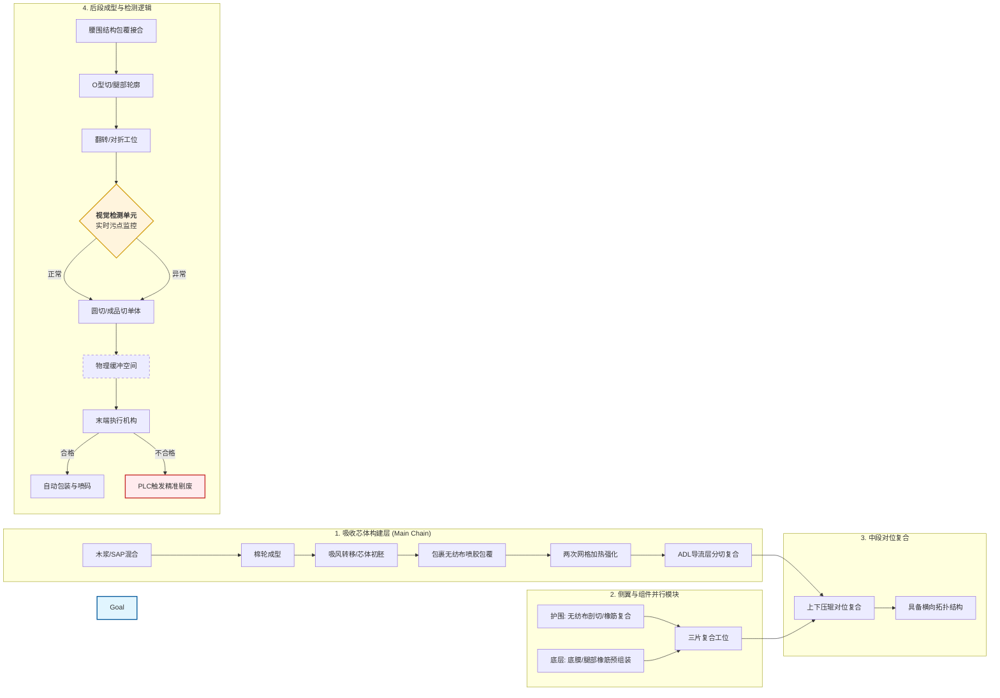

```mermaid
graph LR
    %% 定义功能区
    subgraph Core_Layer ["1. 吸收芯体构建层 (Main Chain)"]
        A1[木浆/SAP混合] --> A2[棉轮成型]
        A2 --> A3[吸风转移/芯体初胚]
        A3 --> A4[包裹无纺布喷胶包覆]
        A4 --> A5[两次网格加热强化]
        A5 --> A6[ADL导流层分切复合]
    end

    subgraph Side_Modules ["2. 侧翼与组件并行模块"]
        B1[护围: 无纺布剖切/橡筋复合] --> B2[三片复合工位]
        C1[底层: 底膜/腿部橡筋预组装] --> B2
    end

    subgraph Assembly ["3. 中段对位复合"]
        A6 --> D1[上下压辊对位复合]
        B2 --> D1
        D1 --> D2[具备横向拓扑结构]
    end

    subgraph Tail_End ["4. 后段成型与检测逻辑"]
        E1[腰围结构包覆接合] --> E2[O型切/腿部轮廓]
        E2 --> E3[翻转/对折工位]
        
        %% 关键视觉检测点
        E3 --> Vision{<b>视觉检测单元</b><br/>实时污点监控}
        
        Vision -- 正常 --> F1[圆切/成品切单体]
        Vision -- 异常 --> F1
        
        F1 --> G1[物理缓冲空间]
        G1 --> G2[末端执行机构]
        
        G2 -->|合格| H1[自动包装与喷码]
        G2 -->|不合格| H2[PLC触发精准剔废]
    end

    %% 样式美化
    style Vision fill:#fff4dd,stroke:#d4a017,stroke-width:2px
    style Goal fill:#e1f5fe,stroke:#01579b,stroke-width:2px
    style H2 fill:#ffebee,stroke:#c62828,stroke-width:2px
    style G1 stroke-dasharray: 5 5
```