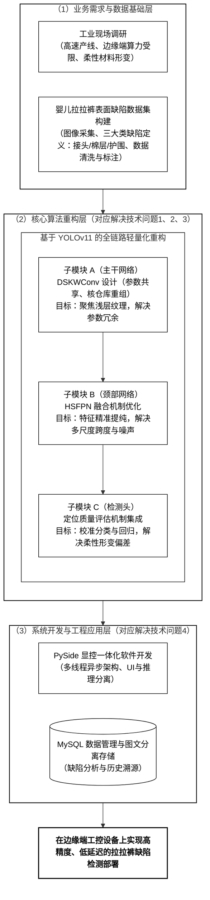

```mermaid
graph TD
    %% 定义全局黑白极简学术风格
    classDef default fill:#ffffff,stroke:#000000,stroke-width:1px,color:#000000;
    classDef strongBox fill:#ffffff,stroke:#000000,stroke-width:2px,font-weight:bold;

    %% 第一层：业务需求与数据基础层
    subgraph Layer1 ["（1）业务需求与数据基础层"]
        direction LR
        A["工业现场调研<br>（高速产线、边缘端算力受限、柔性材料形变）"] 
        B["婴儿拉拉裤表面缺陷数据集构建<br>（图像采集、三大类缺陷定义：接头/棉层/护围、数据清洗与标注）"]
    end

    %% 第二层：核心算法重构层
    subgraph Layer2 ["（2）核心算法重构层（对应解决技术问题1、2、3）"]
        direction TB
        subgraph YOLO ["基于 YOLOv11 的全链路轻量化重构"]
            direction TB
            C["子模块 A（主干网络）<br>DSKWConv 设计（参数共享、核仓库重组）<br>目标：聚焦浅层纹理，解决参数冗余"]
            D["子模块 B（颈部网络）<br>HSFPN 融合机制优化<br>目标：特征精准提纯，解决多尺度跨度与噪声"]
            E["子模块 C（检测头）<br>定位质量评估机制集成<br>目标：校准分类与回归，解决柔性形变偏差"]
            
            C --> D --> E
        end
    end

    %% 第三层：系统开发与工程应用层
    subgraph Layer3 ["（3）系统开发与工程应用层（对应解决技术问题4）"]
        direction LR
        F["PySide 显控一体化软件开发<br>（多线程异步架构、UI与推理分离）"]
        %% 采用圆柱体图形代表数据库，契合参考图风格
        G[("MySQL 数据管理与图文分离存储<br>（缺陷分析与历史溯源）")]
    end

    %% 最终成果
    Result["在边缘端工控设备上实现高精度、低延迟的拉拉裤缺陷检测部署"]:::strongBox

    %% 跨层逻辑连接箭头
    Layer1 --> Layer2
    Layer2 --> Layer3
    Layer3 --> Result

    %% 设定大外框的样式（透明底，加粗黑实线）
    style Layer1 fill:none,stroke:#000000,stroke-width:1.5px
    style Layer2 fill:none,stroke:#000000,stroke-width:1.5px
    style Layer3 fill:none,stroke:#000000,stroke-width:1.5px
    style YOLO fill:none,stroke:#000000,stroke-width:1px
```