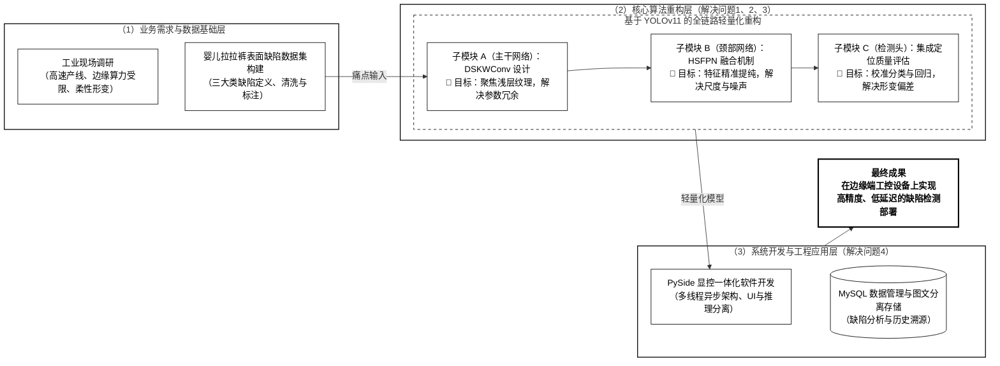

```mermaid
graph LR
    %% 定义全局黑白极简学术风格
    classDef default fill:#ffffff,stroke:#000000,stroke-width:1px,color:#000000;
    classDef strongBox fill:#ffffff,stroke:#000000,stroke-width:2.5px,font-weight:bold;
    classDef hidden stroke-width:0px, fill:none;

    %% 第一层：业务需求与数据基础层
    subgraph Layer1 ["（1）业务需求与数据基础层"]
        direction TB
        A["工业现场调研<br>（高速产线、边缘算力受限、柔性形变）"] 
        B["婴儿拉拉裤表面缺陷数据集构建<br>（三大类缺陷定义、清洗与标注）"]
        
        %% 内部隐形排版线
        A ~~~ B
    end

    %% 第二层：核心算法重构层
    subgraph Layer2 ["（2）核心算法重构层（解决问题1、2、3）"]
        direction TB
        subgraph YOLO ["基于 YOLOv11 的全链路轻量化重构"]
            direction TB
            C["子模块 A（主干网络）：DSKWConv 设计<br>🎯 目标：聚焦浅层纹理，解决参数冗余"]
            D["子模块 B（颈部网络）：HSFPN 融合机制<br>🎯 目标：特征精准提纯，解决尺度与噪声"]
            E["子模块 C（检测头）：集成定位质量评估<br>🎯 目标：校准分类与回归，解决形变偏差"]
            
            C --> D --> E
        end
    end

    %% 第三层：系统开发与工程应用层
    subgraph Layer3 ["（3）系统开发与工程应用层（解决问题4）"]
        direction TB
        F["PySide 显控一体化软件开发<br>（多线程异步架构、UI与推理分离）"]
        G[("MySQL 数据管理与图文分离存储<br>（缺陷分析与历史溯源）")]
        
        %% 内部排版线
        F ~~~ G
    end

    %% 最终成果
    Result["最终成果<br>在边缘端工控设备上实现<br>高精度、低延迟的缺陷检测部署"]:::strongBox

    %% 跨层逻辑连接箭头（使用核心节点连接确保横向排版的直线效果）
    B -->|痛点输入| C
    YOLO -->|轻量化模型| F
    Layer3 --> Result

    %% 设定大外框的样式（透明底，加粗黑实线，YOLO用虚线）
    style Layer1 fill:none,stroke:#000000,stroke-width:1.5px
    style Layer2 fill:none,stroke:#000000,stroke-width:1.5px
    style Layer3 fill:none,stroke:#000000,stroke-width:1.5px
    style YOLO fill:none,stroke:#000000,stroke-width:1px,stroke-dasharray: 5 5
```