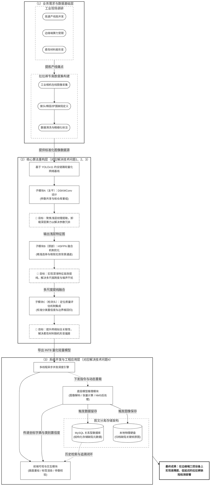

```mermaid
graph TD
    classDef default fill:#fff,stroke:#333,stroke-width:1px,color:#333,font-size:14px;
    classDef targetNode fill:#fff,stroke:#000,stroke-width:1px,stroke-dasharray: 4 4;
    classDef dbNode fill:#fff,stroke:#333,stroke-width:1px,shape:cylinder;
    classDef finalNode fill:#fff,stroke:#000,stroke-width:2px,font-weight:bold;

    subgraph Layer1 ["（1）业务需求与数据基础层"]
        direction TB
        subgraph Req ["工业现场调研"]
            direction LR
            R1(["高速产线高并发"])
            R2(["边缘端算力受限"])
            R3(["柔性材料易形变"])
        end
        
        subgraph Data ["拉拉裤专属数据集构建"]
            direction TB
            D1(["工业相机在线图像采集"])
            D2(["接头/棉层/护围缺陷定义"])
            D3(["数据清洗与精细化标注"])
            D1 --> D2 --> D3
        end
        
        Req -->|提炼产线痛点| Data
    end

    Data -->|提供标准化图像数据源| L2_Entry

    subgraph Layer2 ["（2）核心算法重构层（对应解决技术问题1、2、3）"]
        direction TB
        L2_Entry["基于 YOLOv11 的全链路轻量化网络基线"]
        
        A_Action["子模块A（主干）：DSKWConv 设计
(参数共享与核仓库重组)"]
        A_Target["🎯 目标：聚焦浅层纹理提取，卸载深层算力以解决参数冗余"]:::targetNode
        
        B_Action["子模块B（颈部）：HSFPN 融合机制优化
(精准选择与剔除无效背景通道)"]
        B_Target["🎯 目标：实现深浅特征高效提纯，解决多尺度跨度与噪声干扰"]:::targetNode
        
        C_Action["子模块C（检测头）：定位质量评估机制集成
(校准分类置信度与边界框回归)"]
        C_Target["🎯 目标：提升网络拟合关联性，解决柔性材料随机形变偏差"]:::targetNode
        
        L2_Entry --> A_Action
        A_Action --> A_Target
        A_Target -->|输出浅层特征图| B_Action
        B_Action --> B_Target
        B_Target -->|多尺度提纯融合| C_Action
        C_Action --> C_Target
    end

    C_Target -->|导出 INT8 量化轻量模型| L3_Entry

    subgraph Layer3 ["（3）系统开发与工程应用层（对应解决技术问题4）"]
        direction TB
        L3_Entry["多线程异步并发调度引擎"]
        
        UI["前端可视与交互模块
(画面重绘 / 标签渲染 / 参数校验)"]
        Infer["底层模型推理模块
(图像解码 / 张量计算 / NMS后处理)"]
        
        L3_Entry --> UI
        L3_Entry -.->|下发指令与动态重载| Infer
        Infer -->|传递坐标字典与类别置信度| UI
        
        subgraph Storage ["图文分离存储架构"]
            direction LR
            DB[("MySQL 关系型数据库
(结构化存储缺陷元数据)")]:::dbNode
            Disk[("本地物理硬盘
(归档缺陷关键帧原图)")]:::dbNode
        end
        
        Infer -->|触发数据留存| DB
        Infer -->|触发图像保存| Disk
        
        DB -.->|历史检索与追溯闭环| UI
    end

    Layer3 --> Final["最终成果：在边缘端工控设备上实现高精度、低延迟的拉拉裤缺陷检测部署"]:::finalNode

    style Layer1 fill:none,stroke:#000000,stroke-width:1.5px
    style Layer2 fill:none,stroke:#000000,stroke-width:1.5px
    style Layer3 fill:none,stroke:#000000,stroke-width:1.5px
    style Req fill:none,stroke:#666,stroke-width:1px,stroke-dasharray: 5 5
    style Data fill:none,stroke:#666,stroke-width:1px,stroke-dasharray: 5 5
    style Storage fill:none,stroke:#666,stroke-width:1px,stroke-dasharray: 5 5
```