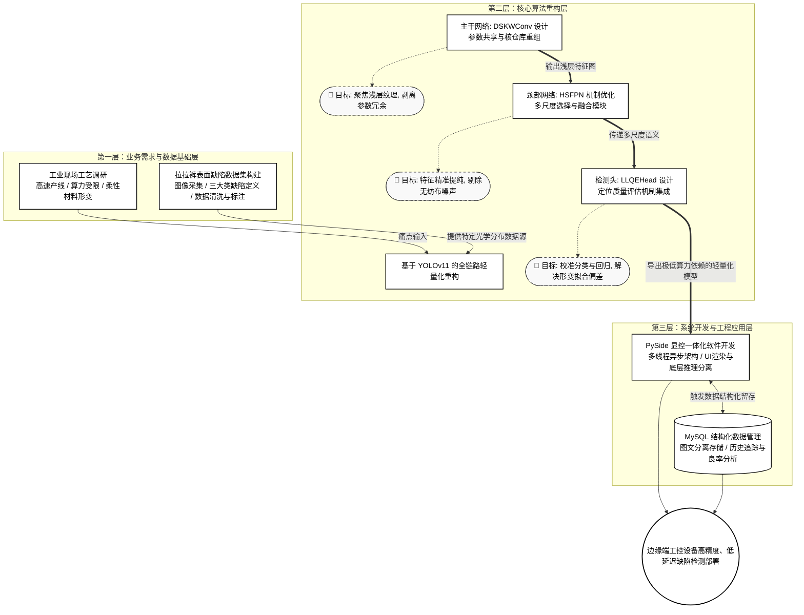

```mermaid
graph TD
    classDef default fill:#FFFFFF,stroke:#000000,stroke-width:1.5px,color:#000000;
    classDef target fill:#F9F9F9,stroke:#333333,stroke-width:1px,stroke-dasharray: 5 5;
    classDef database fill:#FFFFFF,stroke:#000000,stroke-width:1.5px,shape:cylinder;
    classDef result fill:#FFFFFF,stroke:#000000,stroke-width:2px,rx:10px,ry:10px;

    subgraph Layer1 [第一层：业务需求与数据基础层]
        direction LR
        A[工业现场工艺调研<br>高速产线 / 算力受限 / 柔性材料形变]
        B[拉拉裤表面缺陷数据集构建<br>图像采集 / 三大类缺陷定义 / 数据清洗与标注]
    end

    subgraph Layer2 [第二层：核心算法重构层]
        direction TB
        C[基于 YOLOv11 的全链路轻量化重构]
        
        C1[主干网络: DSKWConv 设计<br>参数共享与核仓库重组] 
        T1([🎯 目标: 聚焦浅层纹理, 剥离参数冗余])
        C1 -.-> T1
        
        C2[颈部网络: HSFPN 机制优化<br>多尺度选择与融合模块] 
        T2([🎯 目标: 特征精准提纯, 剔除无纺布噪声])
        C2 -.-> T2
        
        C3[检测头: LLQEHead 设计<br>定位质量评估机制集成] 
        T3([🎯 目标: 校准分类与回归, 解决形变拟合偏差])
        C3 -.-> T3
        
        C1 ==>|输出浅层特征图| C2
        C2 ==>|传递多尺度语义| C3
    end

    subgraph Layer3 [第三层：系统开发与工程应用层]
        direction LR
        D[PySide 显控一体化软件开发<br>多线程异步架构 / UI渲染与底层推理分离]
        E[(MySQL 结构化数据管理<br>图文分离存储 / 历史追踪与良率分析)]
    end

    F((边缘端工控设备高精度、低延迟缺陷检测部署))
    class F result;
    class E database;
    class T1,T2,T3 target;

    A -->|痛点输入| C
    B -->|提供特定光学分布数据源| C
    C3 ===>|导出极低算力依赖的轻量化模型| D
    D <-->|触发数据结构化留存| E
    D --> F
    E --> F
```