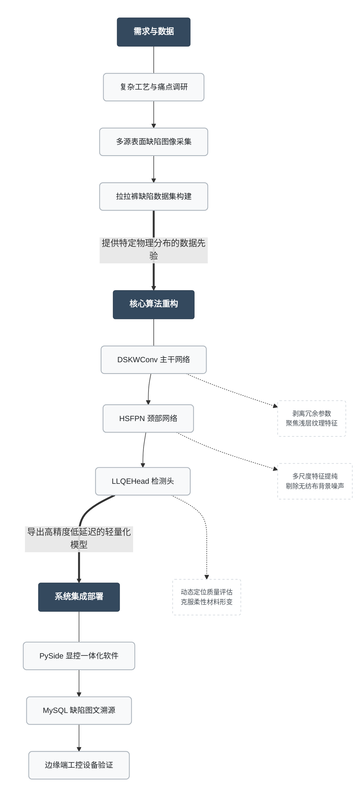

```mermaid
flowchart TB
    %% 全局样式定义 (参照工科论文常见的严谨冷色调风格)
    classDef Tag fill:#34495e,stroke:#2c3e50,stroke-width:1px,color:#ffffff,rx:4px,ry:4px,font-weight:bold,font-size:15px
    classDef Process fill:#f8f9fa,stroke:#adb5bd,stroke-width:1.5px,color:#212529,rx:6px,ry:6px,font-size:14px
    classDef Detail fill:#ffffff,stroke:#ced4da,stroke-width:1px,stroke-dasharray: 4 4,color:#495057,rx:4px,ry:4px,font-size:12px

    %% 第一层：需求与数据
    subgraph Layer1 [ ]
        direction LR
        tag1[需求与数据]:::Tag
        p1[复杂工艺与痛点调研]:::Process
        p2[多源表面缺陷图像采集]:::Process
        p3[拉拉裤缺陷数据集构建]:::Process
        
        tag1 --- p1 --> p2 --> p3
    end

    %% 第二层：核心算法重构
    subgraph Layer2 [ ]
        direction LR
        tag2[核心算法重构]:::Tag
        p4[DSKWConv 主干网络]:::Process
        p5[HSFPN 颈部网络]:::Process
        p6[LLQEHead 检测头]:::Process
        
        tag2 --- p4 --> p5 --> p6
    end

    %% 第三层：系统集成部署
    subgraph Layer3 [ ]
        direction LR
        tag3[系统集成部署]:::Tag
        p7[PySide 显控一体化软件]:::Process
        p8[MySQL 缺陷图文溯源]:::Process
        p9[边缘端工控设备验证]:::Process
        
        tag3 --- p7 --> p8 --> p9
    end

    %% 模块间的纵向逻辑连接
    p3 ==>|提供特定物理分布的数据先验| tag2
    p6 ==>|导出高精度低延迟的轻量化模型| tag3

    %% 算法核心细节的虚线挂载
    d1(剥离冗余参数<br>聚焦浅层纹理特征):::Detail
    d2(多尺度特征提纯<br>剔除无纺布背景噪声):::Detail
    d3(动态定位质量评估<br>克服柔性材料形变):::Detail

    p4 -.-> d1
    p5 -.-> d2
    p6 -.-> d3
    
    %% 隐藏默认的子图边框以实现极简排版
    style Layer1 fill:none,stroke:none
    style Layer2 fill:none,stroke:none
    style Layer3 fill:none,stroke:none
```