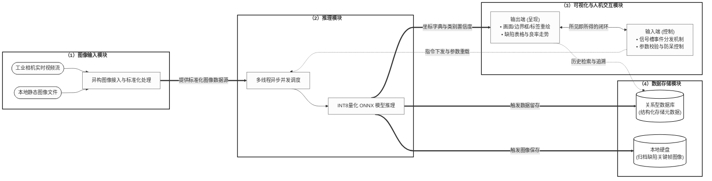

```mermaid
%%{init: {'flowchart': {'nodeSpacing': 40, 'rankSpacing': 60, 'curve': 'bumpX'}}}%%
flowchart LR
    %% 定义整体样式：纯白背景，黑色边框，适合学术论文打印
    classDef moduleNode fill:#ffffff,stroke:#000000,stroke-width:2px,font-weight:bold;
    classDef subNode fill:#fcfcfc,stroke:#555555,stroke-width:1px;
    classDef dbNode fill:#ffffff,stroke:#000000,stroke-width:1.5px;

    %% --- 1. 图像输入模块 ---
    subgraph M1 ["（1）图像输入模块"]
        direction TB
        A1([工业相机实时视频流])
        A2([本地静态图像文件])
        A3[异构图像接入与标准化处理]
        A1 --> A3
        A2 --> A3
    end

    %% --- 2. 推理模块 ---
    subgraph M2 ["（2）推理模块"]
        direction TB
        B1[多线程异步并发调度]
        B2[INT8量化 ONNX 模型推理]
        B1 --> B2
    end

    %% --- 3. 可视化与人机交互模块 ---
    subgraph M3 ["（3）可视化与人机交互模块"]
        direction TB
        C1["输出端 (呈现)<br/>• 画面/边界框/标签重绘<br/>• 缺陷表格与良率走势"]
        C2["输入端 (控制)<br/>• 信号槽事件分发机制<br/>• 参数校验与防呆控制"]
        C1 <-->|所见即所得的闭环| C2
    end

    %% --- 4. 数据存储模块 ---
    subgraph M4 ["（4）数据存储模块"]
        direction TB
        D1[("关系型数据库<br/>(结构化存储元数据)")]
        D2[("本地硬盘<br/>(归档缺陷关键帧图像)")]
    end

    %% --- 模块间的数据流向连线 ---
    A3 ==>|提供标准化图像数据源| B1
    
    B2 ==>|坐标字典与类别置信度| C1
    C2 -.->|指令下发与参数重载| B1
    
    B2 ==>|触发数据留存| D1
    B2 ==>|触发图像保存| D2
    
    C1 -.->|历史检索与追溯| D1

    %% --- 应用样式 ---
    class M1,M2,M3,M4 moduleNode;
    class A1,A2,A3,B1,B2,C1,C2 subNode;
    class D1,D2 dbNode;
```