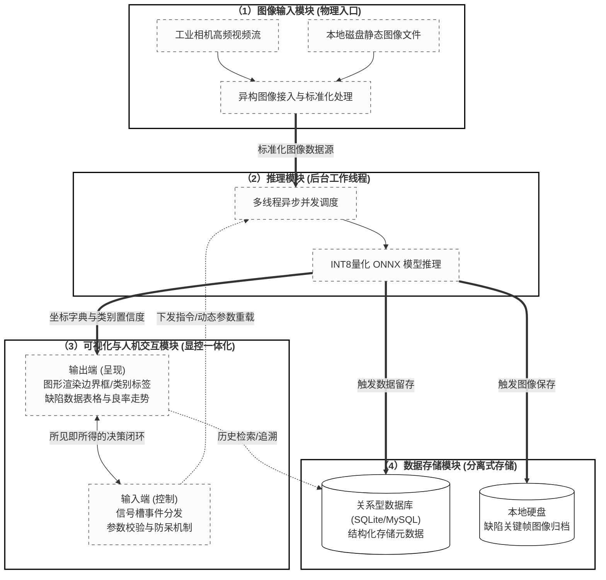

```mermaid
graph TD
    %% 整体样式设置：纯白背景，适合学术论文
    classDef mainModule fill:#ffffff,stroke:#000000,stroke-width:2px,font-weight:bold,font-size:16px;
    classDef subNode fill:#fcfcfc,stroke:#555555,stroke-width:1px,stroke-dasharray: 5 5;
    classDef dbNode fill:#ffffff,stroke:#000000,stroke-width:1px;

    %% 1. 图像输入模块
    subgraph Module1["（1）图像输入模块 (物理入口)"]
        direction TB
        I1[工业相机高频视频流] --> I3[异构图像接入与标准化处理]
        I2[本地磁盘静态图像文件] --> I3
    end

    %% 2. 推理模块
    subgraph Module2["（2）推理模块 (后台工作线程)"]
        direction TB
        R1[多线程异步并发调度] --> R2[INT8量化 ONNX 模型推理]
    end

    %% 3. 可视化与人机交互模块
    subgraph Module3["（3）可视化与人机交互模块 (显控一体化)"]
        direction LR
        V1["输出端 (呈现)<br>图形渲染边界框/类别标签<br>缺陷数据表格与良率走势"]
        V2["输入端 (控制)<br>信号槽事件分发<br>参数校验与防呆机制"]
        V1 <-->|所见即所得的决策闭环| V2
    end

    %% 4. 数据存储模块
    subgraph Module4["（4）数据存储模块 (分离式存储)"]
        direction TB
        S1[("关系型数据库 (SQLite/MySQL)<br>结构化存储元数据")]
        S2[("本地硬盘<br>缺陷关键帧图像归档")]
    end

    %% 模块间的数据流向 (连线)
    I3 == 标准化图像数据源 ==> R1
    
    R2 == "坐标字典与类别置信度" ==> V1
    V2 -. "下发指令/动态参数重载" .-> R1
    
    R2 == 触发数据留存 ==> S1
    R2 == 触发图像保存  ==> S2
    
    V1 -. 历史检索/追溯 .-> S1

    %% 应用样式
    class Module1,Module2,Module3,Module4 mainModule;
    class I1,I2,I3,R1,R2,V1,V2 subNode;
    class S1,S2 dbNode;
  
```